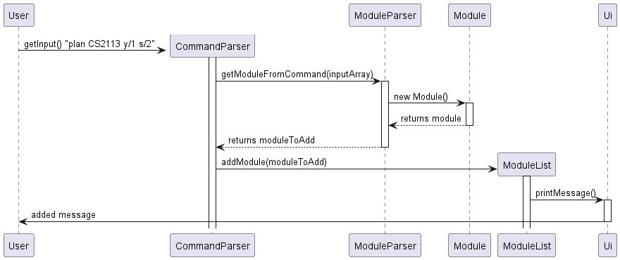
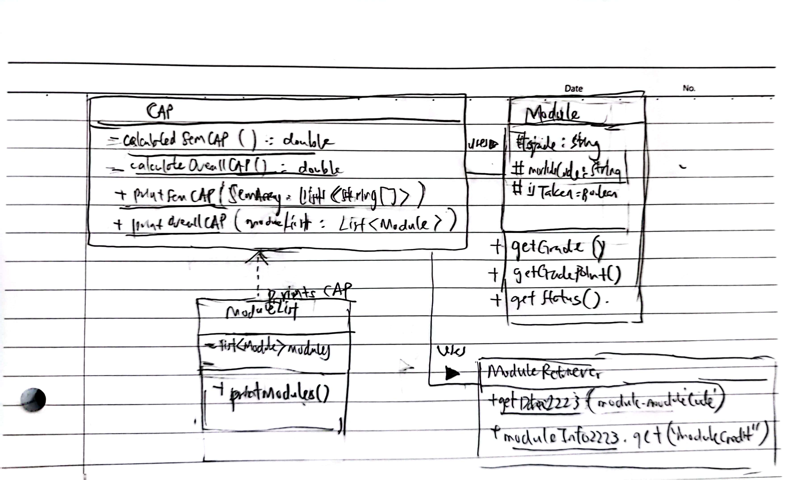

# Developer Guide
<!----------------------------Table of Contents----------------------------------------->
- [Acknowledgements](#acknowledgements)
- [Design](#design)
  - [Architecture](#architecture)
  - [UI Component](#ui-component)
  - [Parser Component](#parser-component)
  - [Storage Component](#storage-component)
  - [Resource Component](#resource-component)
  - [Module Retriever Component](#module-retriever-component)
  - [Module Component](#module-component)
- [Implementation](#implementation)
  - [Add Module](#add-module)
  - [Remove Module](#remove-module)
  - [Mark Module As Taken](#mark-module-as-taken)
  - [List Modules](#list-modules)
  - [Display Status](#display-status)
  - [Get Module Details](#get-module-details)
  - [Initialise User](#initialise-user)
  - [Save To Local Drive](#save-plan-to-local-drive)
- [Documentation, logging, testing, configuration, dev-ops](#documentation-logging-testing-configuration-dev-ops)
  - [Documentation](#documentation)
  - [Logging](#logging)
  - [Testing](#testing)
  - [Configuration](#configuration)
  - [Dev-ops](#dev-ops)
- [Appendix A: Requirements](#appendix-a--requirements)
- [Appendix B: Instructions for manual testing](#appendix-b--instructions-for-manual-testing)
<!----------------------------Acknowledgements----------------------------------------->
## Acknowledgements
{list here sources of all reused/adapted ideas, code, documentation, and third-party libraries -- include links to the original source as well}

<!----------------------------Design----------------------------------------->
## Design

{Describe the design and implementation of the product. Use UML diagrams and short code snippets where applicable.}
### Architecture

### UI Component

### Parser Component

### Storage Component

### Resource Component

### Module Retriever Component

### Module Component

<!----------------------------Implementation----------------------------------------->
## Implementation
### Add module
The Add Module features allows users to add two types of modules (taken or planning) to the ModuleList using the commands `plan` or `taken`. The two types of modules are differentiated by its `Module()` overloaded constructor, accepting different type signatures. It is facilitated by `ModuleList`.

Given below is an example usage scenario of the 2 types of modules and how the add module mechanism behaves at each step.

**When a planned module is added:**
Step 1. The user launches the application for the first time. The ModuleList will be initialised with the initial module list state if provided in `penus.txt`.

Step 2. The user executes the `plan CS2113 y/1 s/2` command to plan the module CS2113 for year 1 and semester 2 to be added into the list. The `plan` command is executed within the switch case of the `parseCommand()` method of `CommandParser`.

Step 3. If a valid command is provided, a new `Module` will be instantiated within `ModuleParser` where another switch case is executed. The `ModuleParser` is extracted away from the `CommandParser` for more readability. The string is then split into parts separated by the flags `y/` and `s/` into a `planDetails` array. An overloaded constructor `Module()` is instantiated with the arguments corresponding to the array which sets the `isTaken` parameter `false`. The arguments are `moduleCode`, `year` and `semester`.

Step 4. The new `Module` object is then returned to the `CommandParser` where it is assigned and added to the `ModuleList`. The `addModule()` method is then executed in `ModuleList`. 

Step 5. It first checks if the module already exists in the list by iterating through the current list and checking for the same `moduleCode`. If so, `DuplicateModuleException` is thrown. If the module does not exist, it is added to the `ModuleList` by calling the `add()` method of the class. 

Step 6. A confirmation message is printed to indicate the success of the module addition. This is called using the `printMessage()` method from `Ui` which accpets an array of strings as message lines.

The following sequence diagram shows how the `plan` command works:

**Similarly, for when a taken module is added:**
Step 1. The user launches the application for the first time. The ModuleList will be initialised with the initial module list state if provided in `penus.txt`.

Step 2. The user executes the `taken CS2113 y/1 s/2 g/A+` command to plan the module CS2113 for year 1 and semester 2 to be added into the list. The `plan` command is executed within the switch case of the `parseCommand()` method of `CommandParser`.

Step 3. If a valid command is provided, a new `Module` will be instantiated within `ModuleParser` where another switch case is executed. The `ModuleParser` is extracted away from the `CommandParser` for more readability. The string is then split into parts separated by the flags `y/`, `s/` and `g/` into a `takenDetails` array. An overloaded constructor `Module()` is instantiated with the arguments corresponding to the array which sets the `isTaken` parameter `true`. The arguments are `moduleCode`, `year`, `semester` and `grade`.

Step 4 - 6. Identical to that of a `plan` command as mentioned above.

### Remove module
(TBA)

### Mark module as taken
(TBA)

### List modules
The List modules feature allows users to view their added modules, in a specified range using the command `list`. There are 3 ways of modules listing :
1. List all modules in the planner
2. List all modules in the planner for a specific year
3. List all modules in the planner for a specific year and semester

Given below is an example usage scenario for each type, and how the list modules mechanism behaves at each step.

**When the year and semester are not specified:**
Step 1. The user executes the command `list`, without any specified year or semester range, to list all modules in the planner. The `list` command is executed within the switch case of the `parseCommand()` method of `CommandParser`.

Step 2. If a valid command is entered, the `printModule` method of `ModuleList` will be executed with the inputs of -1 for both the year and semester.

Step 3. In `printModule` of `ModuleList`, a `Map<Integer, Map<Integer, List<String[]>>>` Hashmap is iniitialised, and all the modules stored in the `modules` container is added to the Hashmap.

Step 4. The year and semester have values of -1, which then `printModules` recognises as printing all modules in the Hashmap. A `L`ist<String[]> modules` is initialised with all the modules in the Hashmap.

Step 5. If `modules` is not empty, the modules for that year and semester are printed sequentially. For modules with available grade information, the grade will be printed beside the module code.

**When the year is specified:**

Step 1. The user executes the command `list y/1`, with the year specified, but not the semester, to print the modules for both semesters in Year 1. The `list` command is executed within the switch case of the `parseCommand()` method of `CommandParser`.

Step 2. If a valid command is entered, the `printModule` method of `ModuleList` will be executed. The string `inputArray` is then split into parts separated by the flags `y/` and `s/` into a `rangeToPrint` array.

Step 3. If the year entered is valid, the integer `yearSpecified` is assigned parsed from the String that the user entered. The integer `semesterSpecified` is assigned to 0. The `printModule` method of `ModuleList` is called with the `yearSpecified` and `semesterSpecified` as inputs, and `semesterSpecified` is valued at -1.

Step 3. In `printModule` of `ModuleList`, a `Map<Integer, Map<Integer, List<String[]>>>` Hashmap is initialised, and all the modules stored in the `modules` container is added to the Hashmap.

Step 4. A `List<String[]> modules` is initialised with all the modules in the Hashmap.

Step 5. If `modules` is not empty, the modules for that year and both its semesters are printed sequentially. For modules with available grade information, the grade will be printed beside the module code.

**When the year and semester are specified:**

Step 1. The user executes the command `list y/1 s/2`, with the year and semester specified, to print the modules for Year 1 Semester 2. The `list` command is executed within the switch case of the `parseCommand()` method of `CommandParser`.

Step 2. If a valid command is entered, the `printModule` method of `ModuleList` will be executed. The string `inputArray` is then split into parts separated by the flags `y/` and `s/` into a rangeToPrint array.

Step 3. If the year entered is valid, the integer `yearSpecified` and `semesterSpecified` is parsed from the String that the user entered. The `printModule` method of `ModuleList` is called with the `yearSpecified` and `semesterSpecified` as inputs.

Step 3. In `printModule` of `ModuleList`, a `Map<Integer, Map<Integer, List<String[]>>>` Hashmap is iniitialised, and all the modules stored in the `modules` container is added to the Hashmap.

Step 4. A `List<String[]> modules` is initialised with all the modules in the Hashmap.

Step 5. If `modules` is not empty, the modules for that specified year and semester are printed sequentially. For modules with available grade information, the grade will be printed beside the module code.

### Display status
The Display Status feature `status` lists all the core modules in the user's course, and indicates which ones the user has or has
not taken. The feature also displays the total number of MCs the user has taken.

Given below is an example of how `status` is called at each step.

Step 1: The user executes the `status` command to check his current graduation status. The `status` command is executed
within the switch case of the `parseCommand()` method of the `CommandParser`. The Command Parser will then call
`printStatus()` of the `ModuleList` class.

Step 2: When `printStatus()` is first executed, the method calls `getTakenCoreModsList()` and `getUntakenCoreModsList()`
to return a list of string of core module codes that the user has taken/not taken respectively. `getTakenCoreModList()` and
`getUntakenCoreModsList()` work by first retrieving the list of all core mods from the Resource Manager class through the`getCoreMods()`
method, which returns a hashmap with the course as the key and list of string of core module codes. In order to get
the core module codes of the user's course, the user's course is retrieved from the `User` class, at which the
attribute `course` is given by the user on initialization. An exception is thus triggered if the user calls `status()`
without initialising. By giving the key as the user's course, the list of core modules is retrieved. For
`getTakenCoreModsList()`, the list of core module
codes is then compared with the all the modules taken by the user in `modules` to return the list of core modules codes that the
user has/ has not taken.

Step 3: In order to get the status of GE modules, the printStatus() method then calls 3 methods, `getGESS()`, `getGEN()` and
`getGEC()` , which loops through the user's `modules` and check if the user has taken those modules and returns the module code
if taken.

Step 4: The printStatus() then prints the list of taken/ untaken by calling the `printStatusFunction()`. The `printStatusFunction()` method
takes in each module's code retrieves the title and MCs through `ModuleRetriever` class, then prints it out.

Step 5: Lastly, the printStatus() method calls `numberOfMcs()`, retrieves each module's MC through the `Module Retriever`
class and returns the totals number of MCs. The printStatus() method then prints the total number of MCs / 160.

### Get module details
(TBA)

### Initialise user
(TBA)

### Calculate CAP
Under the list of modules taken/planned is the Semester CAP, and Overall CAP for the whole course of study.
This is implemented by the following methods:
<ul> 
<li>printSemCAP(): calls calculateSemCAP() and prints output to 2 decimal points </li>
<li>calculateSemCAP(): calculates the CAP for the semester to be calculated for </li>
<li>printOverallCAP(): calls calculateOverallCAP() and prints output to 2 decimal points </li>
<li>calculateOverallCAP(): calculates the overall CAP for all completed semesters </li>  
</ul>

Below is the sequence of steps which utilises the CAP mechanism:

Step 1: 
You already initialised yourself as a new user.
The user adds 3 module as taken `CG2023 y/1 s/2 g/A+` and `CG2111A y/1 s/2 g/B+` 
and `CG1111A y/1 s/1 g/A+`.
Currently, there are three taken modules in his planner.

Step 2:
User enters 'list' which calls `moduleList.printModules()`.
For y1s1, under the mods listed, user would see a printed CAP of 5.00.
For y1s2, under the mods listed, user would see a printed CAP of 4.50.
The overall CAP printed is 4.67.

Class Diagram:

### Save planner to local drive
(TBA)

<!----------------------------Documentation----------------------------------------->
## Documentation, logging, testing, configuration, dev-ops
### Documentation
### Logging
### Testing
### Configuration
### Dev-ops

<!----------------------------Appendix A----------------------------------------->
## Appendix A: Requirements
### Product scope

#### Target user profile
- NUS engineering students
- prefers desktop CLI over other available planner application(s)
- prefers typing to mouse interactions

#### Value proposition
Manage a planner faster and more efficiently than a typical mouse/GUI driven application

### User Stories
Priorities: High (must have) - `* * *`, Medium (nice to have) - `* *`, Low (unlikely to have) - `*`

| Priority | Version |         As a ...         | I want to ...                          | So that I can ...                                                   |
|:--------:|:-------:|:------------------------:|:---------------------------------------|:--------------------------------------------------------------------|
|   ***    |  v1.0   |         student          | add modules to the planner             | keep track of my planned and taken modules for my study term        |
|   ***    |  v1.0   |         student          | remove modules                         | remove modules that I have accidentally added                       |
|   ***    |  v1.0   |         student          | list all the modules in my planner     | see all modules I am planning for and have taken for the study term |
|   ***    |  v1.0   |         student          | mark a planned module as taken         | update my planner accordingly                                       |
|   ***    |  v1.0   | penultimate year student | display graduation status              | graduate on time                                                    |
|    **    |  v2.0   |         student          | see realtime module details            | understand module details without referring to other websites       |
|    **    |  v2.0   |         student          | check whether I meet the prerequisites | plan my timetable with less worries                                 |
|   ***    |  v2.0   |         student          | keep track of my CAP                   | I do not need to calculate my CAP after every semester              |
|   ***    |  v2.0   |         new user         | see usage instructions                 | refer to them in case I forget the application commands             |
|    **    |  v2.0   |      returning user      | save my planner                        | I do not need to re-add my modules                                  |
|   ***    |  v2.0   |         new user         | include my course                      | plan for course-specific core modules                               |

### Use cases

### Non-Functional Requirements
- PENUS should work on any mainstream OS as long as it has Java 11 or above installed.
- PENUS should be able to hold up to 1000 modules without a noticeable sluggishness in performance for typical usage.
- A user with above average typing speed for regular English text (i.e. not code, not system admin commands) should be able to accomplish most of the tasks faster using commands than using the mouse.

### Glossary

* *Mainstream OS* - Windows, Linux, Unix, OS-X
* *CLI* - Command Line Interface

<!----------------------------Appendix B----------------------------------------->
##  Appendix B: Instructions for manual testing
Given below are instructions to test the app manually.
> Note: These instructions only provide a starting point for testers to work on;
> testers are expected to do more *exploratory* testing. 