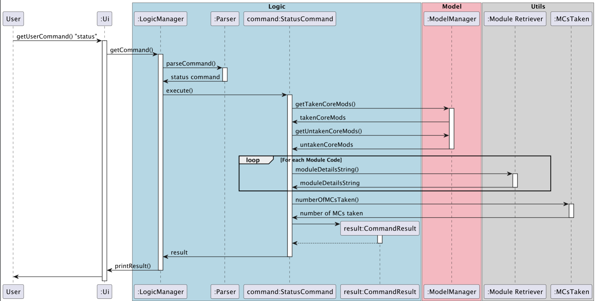
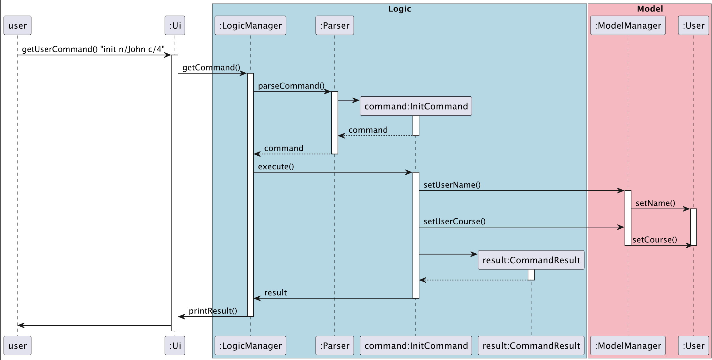

# Developer Guide
<!----------------------------Table of Contents----------------------------------------->
- [Acknowledgements](#acknowledgements)
- [Design](#design)
  - [Architecture](#architecture)
  - [UI Component](#ui-component)
  - [Logic Component](#logic-component)
  - [Model Component](#model-component)
  - [Storage Component](#storage-component)
  - [Common classes](#common-classes)
- [Implementation](#implementation)
  - [Add Module](#add-module)
  - [Remove Module](#remove-module)
  - [Mark Module As Taken](#mark-module-as-taken)
  - [List Modules](#list-modules)
  - [Display Status](#display-status)
  - [Get Module Details](#get-module-details)
  - [Initialise User](#initialise-user)
  - [Clear Modules](#clear-modules)
  - [Save To Local Drive](#save-planner-to-local-drive)
  - [[Proposed] Handle CS/CU Grade](#proposed-handle-cscu-modules)
- [Appendix A: Product Scope](#appendix-a-product-scope)
- [Appendix B: User Stories](#appendix-b-user-stories)
- [Appendix C: Non-Functional Requirements](#appendix-c-non-functional-requirements)
- [Appendix D: Glossary](#appendix-d-glossary)
- [Appendix E: Instructions for Manual Testing](#appendix-e-instructions-for-manual-testing)
  - [Launch](#launch)
  - [Plan Command](#plan-command)
  - [Remove Command](#remove-command)
  - [Mark Command](#mark-command)
  - [Loading Data](#loading-data)

<!----------------------------Acknowledgements----------------------------------------->
## Acknowledgements
References made from [AddressBook 2](https://github.com/se-edu/addressbook-level2) and [AddressBook 3](https://github.com/se-edu/addressbook-level3).


<!----------------------------Design----------------------------------------->
## Design

### Architecture


The **Architecture Diagram** given above explains the high-level design of the App.

Given below is a quick overview of main components and how they interact with each other.
#### Main components of the architecture
`Main` is responsible for:
- At app launch: Initializes the components in the correct sequence, and connects them up with each other with the correct methods.
- At shut down: Shuts down the components and invokes cleanup methods where necessary.

`Commons` represents a collection of classes used by multiple other components and includes:
- `Exceptions`: handles error and extends PenusException
- `Utils`: utility static methods like NUSMods API and other string manipulation
- `Messages`: Logo, goodbye and welcome messages of the App

The rest of the App consists of four components.

- `UI`: The UI of the App.
- `Logic`: The command executor.
- `Model`: Holds the data of the App in memory.
- `Storage`: Reads data from, and writes data to, the hard disk.


### UI Component
The component is specified in `Ui.java`


The `UI` component:
- displays messages to the user by printing to the CLI.
- displays results from commands executed by the `LogicManager` class.

### Logic Component
The component is specified in `logic` package and facilitated by `LogicManager.java`


How the `Logic` component works:
1. When `LogicManager` is called upon to execute a command, it uses the `Parser` class to parse the user command.
2. This results in a `Command` object (more precisely, an object of one of its subclasses e.g., `AddCommand`) which is executed by the `LogicManager`.
3. The command can communicate with the `ModelManager` when it is executed (e.g. to add a module).
4. The result of the command execution is encapsulated as a `CommandResult` object which is returned back from Logic and printed into the CLI.


### Model Component
The component is specified in `model` package and facilitated by `ModelManager.java`


The `Model` component:
- stores the module list data i.e., all `Module` objects (which are contained in a `ModuleList` object).
- stores a `User` object that represents the user’s preferences (name and course).
- stores the core module details as a `HashMap` object, initialised by a .txt file with core modules for each course.
- does not depend on any of the other three components (as the Model represents data entities of the domain, they should make sense on their own without depending on other components)


### Storage Component
The component is specified in `storage` package and facilitated by `StorageManager.java`


The `Storage` component:
- can save both module list data and user data in .txt format, and read them back into corresponding objects.
- retrieves core module details from a prefilled .txt file formatted as a resource.
- depends on some classes in the `Model` component (because the `Storage` component’s job is to save/retrieve objects that belong to the `Model`)


### Common classes
Classes used by multiple components are in the `seedu.penus.commons` package.

<!----------------------------Implementation----------------------------------------->
## Implementation
### Add module
The Add Module feature allows users to add two types of modules (taken or planning) to the ModuleList using the commands `plan` or `taken`. The two types of modules are differentiated by its `Module()` overloaded constructor, accepting different type signatures. It is facilitated by `LogicManager` and extends the abstract class `Command`.

Given below is an example usage scenario of the 2 types of modules and how the add module mechanism behaves at each step.

**When a planned module is added:**

**Step 1.** The user launches the application for the first time. The ModuleList will be initialised with the initial module list state if provided in `penus.txt`.

**Step 2.** The user executes the `plan CS2113 y/1 s/2` command to plan the module CS2113 for year 1 and semester 2 to be added into the list. The `plan` command is parsed through `Parser` which returns a `PlanCommand()` object if a valid command is provided. The `PlanCommand()` constructs a `Module()` object with the overloaded constructor `Module()`. It is instantiated with the respective arguments which sets the `isTaken` parameter `false`, `moduleCode`, `year` and `semester`.

**Step 3.** This is then executed by the `LogicManager` calling `execute()` and passes it to the `ModelManager` through the `addModule()` method. In `ModelManager`, the `Module()` object is passed to the `ModuleList()` where the module is added to the list.

**Step 4.** Upon successful execution of all of the above, it is then passed back to `PlanCommand` where  `CommandResult()` is constructed with the message to be printed to the user.

**Step 5.** The `CommandResult` object is passed to the `Ui` component with a `printMessage()` method which prints the formatted message to the Command Line Interface.

The following sequence diagram shows how the `plan` command works:


**Similarly, for when a taken module is added:**

**Step 1.** The user launches the application for the first time. The ModuleList will be initialised with the initial module list state if provided in `penus.txt`.

**Step 2.** The user executes the `taken CS2113 y/1 s/2 g/A+` command to plan the module CS2113 for year 1 and semester 2 to be added into the list. The `taken` command is parsed through `Parser` which returns a `TakenCommand()` object if a valid command is provided. The `TakenCommand()` constructs a `Module()` object with the overloaded constructor `Module()`. It is instantiated with the respective arguments which sets the `isTaken` parameter `true`, `moduleCode`, `year`, `semester` and `grade`.

**Step 3 - 6.** Identical to that of a `plan` command as mentioned above.

_Design considerations:_
**Aspect: How plan/taken executes**
- **Alternative 1 (current choice):** Have an overloaded Module() constructor which accepts both types of modules. The difference being the isTaken parameter.
  - Pros: Easy to implement
  - Cons: Less readability and harder to differentiate the two.
- **Alternative 2:** Have two classes, TakenModule and PlanModule, for the 2 types.
  - Pros: More readability and easier differentiation.
  - Cons: More complex. 2 classes inherited + checking the class type in queries

<br>

### Remove module
The Remove Module feature allows users to remove a module from the ModuleList using the command `remove`. It is facilitated by `LogicManager` and extends the abstract class `Command`. The module code is given as the argument to remove that specific module.

Given below is an example scenario of the remove command and how it behaves at each step.

**Step 1.** The user executes the `remove CS2113` command, given that a module `CS2113` exists within the `ModuleList`, to remove the module. The `remove` command is parsed through `Parser` which returns a `RemoveCommand()` object if a valid command is provided. The `RemoveCommand()` stores the string `moduleCode` as its attribute.

**Step 2.** The `RemoveCommand` is then executed by the `LogicManager` calling `execute()`. Then, the `ModuleList`, which is retrieved from the `ModelManager` through `getModuleList()`, is iterated through to find the index of a `Module` with the same corresponding `moduleCode` through `getModule().getCode()`. This index is assigned to a variable.

**Step 3.** It is then passed to the `ModelManager`, along with the index, and executes the `removeModule()` method on the `ModuleList` object. The `ModuleList` subsequently executes the `remove(index)` method to remove the module from the list.

**Step 4.** Upon successful execution of the above, it is then passed back to `RemoveCommand` where  `CommandResult()` is constructed with the message to be printed to the user.

**Step 5.** The `CommandResult` object is passed to the `Ui` component with a `printMessage()` method which prints the formatted message to the Command Line Interface.

The following sequence diagram shows how the `remove` command works:


<br>

### Mark module as taken
The Mark Module feature allows user to mark a plan module as a taken module, adding the grade using the command `mark`. It is facilitated by `LogicManager` and extends the abstract class `Command`. The module code and grade is given as the argument to convert that specific planned module to a taken module and add a grade.

Given below is an example scenario of the mark command and how it behaves at each step.

**Step 1.** The user executes the `mark CS2113 g/A+` command, given that a plan module `CS2113` exists within the `ModuleList`, to mark the module. The `mark` command is parsed through `Parser` which returns a `MarkCommand()` object if a valid command is provided. The `MarkCommand()` stores the string `moduleCode` and `grade` as its attributes.

**Step 2.** The `MarkCommand` is then executed by the `LogicManager` calling `execute()`. Then, the  `ModuleList`, which is retrieved from the `ModelManager` through `getModuleList()`, is iterated through to find the index of a `Module` with the same corresponding `moduleCode` through `getModule().getCode()`. This index is assigned to a variable.

**Step 3.** It is then passed to the `ModelManager`, along with the index and grade, and executes the `markModule()` method. It retrieves the `Module` object from the `ModuleList` through the `getModule(index)` method. The `markTaken()` method is then called on this `Module` which sets the `isTaken` attribute as true and saves the grade. 

**Step 4.** Upon successful execution of the above, it is then passed back to `MarkCommand` where  `CommandResult()` is constructed with the message to be printed to the user.

**Step 5.** The `CommandResult` object is passed to the `Ui` component with a `printMessage()` method which prints the formatted message to the Command Line Interface.

The following sequence diagram shows how the `mark` command works:


<br>

### List modules
The List modules feature allows users to view their added modules, in a specified range using the command `list [FILTER]`. There are 3 ways of modules listing :
  1. List all modules in the planner
  2. List all modules in the planner for a specific year
  3. List all modules in the planner for a specific year and semester

Given below is an example usage scenario for each type, and how the list modules mechanism behaves at each step.

**When the year and semester are not specified:**

**Step 1.** The user types in `list`, which will be taken in by the `getUserCommand()` method of the `Ui` class. 
The input command will then be passed to the `LogicManager` class by `getCommand()` and calls `parseCommand()` in the `Parser` class 
which returns the main command, `ListCommand`, if a valid command is entered. 
The `LogicManager` then calls `execute()` on `ListCommand`, which runs the main logic behind this command.
In this example, `list means that the user wants to list all modules in the planner for all semesters from Year 1 to 4.

**Step 2.** `Parser` returns a `ListCommand()` object with no arguments.

**Step 3.** In `CommandResult` of `ListCommand`, a `List<String> messageArray` list, `Map<Integer, Map<Integer, List<String[]>>>` Hashmap and `List<Module> moduleList` ArrayList
are initialised. The `List<Module>` ArrayList is a ModuleList object, which contains all modules in the planner. 
Then, all the modules in `moduleList` are copied to the Hashmap, along with all their details such as their Year, Semester and Grade.

**Step 4.** In the `ListCommand` class, the `year` and `semester` have default values of 0. When `ListCommand` is called without any year and semester specifications, the year and semester values of 0 will be passed to `CommandResult`.
Then, a `List<String> allModules` list will be initialised, and the `getAllMods` method is called to retrieve all modules to be stored in `allModules`.

**Step 5.** In the `getAllMods` method, a `List<String> messageList` is initialised. `messageList` is used to store the string inputs to be returned to `CommandResult`. 
A `List<String[]> modulesInYearSem` is initialised, which copies all module details from the Hashmap.

**Step 6.** If `modulesInYearSem` is not empty, then `modulesInYearSem` will be iterated through to be appended to `messageList` as a String, and the `messageList` list will be returned to `CommandResult`.

**Step 7.** In `CommandResult`, the returned `messageList` list will have its contents copied into an `allModules` list. This `allModules` list will have its contents appended to the `messageArray` of `CommandResult`. 
Then, `getOverallCap` of `Grade` is called to retrieve the overall CAP for the user, and this string is appended to `msessageArray`.  
Lastly, a new `CommandResult()` is constructed with the message to be printed to the user.

**Step 8.** The `CommandResult` object is passed to the `Ui` component with a `printMessage()` method which prints the formatted message to the Command Line Interface. 

Below is a sequence diagram of how the `list` command works: 


**When the year is specified:**

**Step 1.** The user types in `list y/1`, which will be taken in by the `getUserCommand()` method of the `Ui` class.
The input command will then be passed to the `LogicManager` class by `getCommand()` and calls `parseCommand()` in the `Parser` class which returns the main command, `ListCommand`, if a valid command is entered.
The `LogicManager` then calls `execute()` on `ListCommand`, which runs the main logic behind this command.
In this example, `list y/1` means that the user wants to list all modules in the planner for Year 1, i.e. both semesters in Year 1.

**Step 2.** `Parser` returns a `ListCommand()` object with the year that the user entered, as the argument.

**Step 3.** In `CommandResult` of `ListCommand`, a `List<String> messageArray` list, `Map<Integer, Map<Integer, List<String[]>>>` Hashmap and `List<Module>` ArrayList named `moduleList`
are initialised. The `List<Module>` ArrayList is a ModuleList object, which contains all modules in the planner.
Then, all the modules in `moduleList` are copied to the Hashmap, along with all their details such as their Year, Semester and Grade.

**Step 4.** In the `ListCommand` class, the `year` and `semester` have default values of 0. When `ListCommand` is called with only the year specified, the year value that the user entered and the default semester value of 0 will be passed to `CommandResult`.
Then, a `List<String> yearModules` list will be initialised, and the `getYearMods` method is called to retrieve all modules to be stored in `yearModules`.

**Step 5.** In the `getYearMods` method, a `List<String> messageList` is initialised. `messageList` is used to store the string inputs to be returned to `CommandResult`.
A `List<String[]> modulesInYear` is initialised, which copies all module details from modules of the specified year, from the Hashmap. 
For this example, `year` is *1* and thus all modules with `year` as *1* will be copied to `modulesInYear`. 

**Step 6.** If `modulesInYear` is not empty, then `modulesInYear` will be iterated through to be appended to `messageList` as a String, and the `messageList` list will be returned to `CommandResult`.

**Step 7.** In `CommandResult`, the returned `messageList` list will have its contents copied into an `yearModules` list. This `yearModules` list will have its contents appended to the `messageArray` of `CommandResult`.
For each semester in the year, the CAP for that semester will be retrieved through `getSemCAP` of `Grade`. This information is appended to `messageArray` as a String.
Then, `getOverallCap` of `Grade` is called to retrieve the overall CAP for the user, and this string is appended to `msessageArray`.  
Lastly, a new `CommandResult()` is constructed with the message to be printed to the user.

**Step 8.** The `CommandResult` object is passed to the `Ui` component with a `printMessage()` method which prints the formatted message to the Command Line Interface.

**When the year and semester are specified:**

**Step 1.** The user types in `list y/2 s/1`, which will be taken in by the `getUserCommand()` method of the `Ui` class.
The input command will then be passed to the `LogicManager` class by `getCommand()` and calls `parseCommand()` in the `Parser` class which returns the main command, `ListCommand`, if a valid command is entered.
The `LogicManager` then calls `execute()` on `ListCommand`, which runs the main logic behind this command. 
In this example, `list y/2 s/1` means that the user wants to list all modules in the planner for Year 2 Semester 1.

**Step 2.** `Parser` returns a `ListCommand()` object with the year and semester that the user entered, as the arguments.

**Step 3.** In `CommandResult` of `ListCommand`, a `List<String> messageArray` list, `Map<Integer, Map<Integer, List<String[]>>>` Hashmap and `List<Module>` ArrayList named `moduleList`
are initialised. The `List<Module>` ArrayList is a ModuleList object, which contains all modules in the planner.
Then, all the modules in `moduleList` are copied to the Hashmap, along with all their details such as their Year, Semester and Grade.

**Step 4.** In the `ListCommand` class, the `year` and `semester` have default values of 0. When `ListCommand` is called with both the year and semester specified, the year and semester values that the user entered will be passed to `CommandResult`.
Then, a `List<String> semModules` list will be initialised, and the `getSemMods` method is called to retrieve all modules to be stored in `semModules`.

**Step 5.** In the `getSemMods` method, a `List<String> messageList` is initialised. `messageList` is used to store the string inputs to be returned to `CommandResult`.
A `List<String[]> modulesInYearAndSem` is initialised, which copies all module details from modules of the specified year, from the Hashmap.
For this example, `year` is *2*, `semester` is *1*, and thus all modules with `year` as *2* and `semester` as *1* will be copied to `modulesInYearAndSem`.

**Step 6.** If `modulesInYearAndSem` is not empty, then `modulesInYearAndSem` will be iterated through to be appended to `messageList` as a String, and the `messageList` list will be returned to `CommandResult`.

**Step 7.** In `CommandResult`, the returned `messageList` list will have its contents copied into an `semModules` list. This `semModules` list will have its contents appended to the `messageArray` of `CommandResult`.
The CAP for this semester will be retrieved through `getSemCAP` of `Grade`. This information is appended to `messageArray` as a String.
Then, `getOverallCap` of `Grade` is called to retrieve the overall CAP for the user, and this string is appended to `msessageArray`.  
Lastly, a new `CommandResult()` is constructed with the message to be printed to the user.

**Step 8.** The `CommandResult` object is passed to the `Ui` component with a `printMessage()` method which prints the formatted message to the Command Line Interface.

<br>

### Display status
The Display Status feature `status` lists all the core modules in the user's course, and indicates which ones the user has or has
not taken. The feature also displays the total number of MCs the user has taken.

Given below is an example of how `status` is called at each step.

**Step 1.** The user types in `status`, which will be taken in by the `getUserCommand()` method of the `Ui` class. The input command
will then be passed to the `LogicManager` class by `getCommand()` and calls `parseCommand()` which returns the main command, `StatusCommand`. 
The `LogicManager` then calls `execute()` on `StatusCommand`, which runs the main logic behind this command.

**Step 2.** When `execute()` is first called, `getUserName()` and `getUserCourse()` of the `ModelManager` class are called to return
the user's `name` and `course` and added to the message.


**Step 3.** The methods then calls `getTakenCoreModsList()`. `getTakenCoreModsList()` first calls the `ModelManager`'s `getCoreModsList()`  which returns a hashmap with the course as the key and list of string of core module codes. In order to get
the core module codes of the user's course, the user's course is retrieved from by `ModelManager`'s `getUserCourse()`, at which the
attribute `course` is given by the user on initialization. An exception is thus triggered if the user calls `status()`
without initialising. By giving the key as the user's course, the list of core modules is retrieved. The list of core modules is then compared against 
the user's `ModuleList`, retrieved by `ModelManager`'s `getModuleList()` and taken core module codes will be added into `takenCoreMods` list. Lastly, it calls
`getTakenGESS()`, `getTakenGEC()` and `getTakenGEN()` to check for the status of GE modules and adds their codes into `takenCoreMods` if taken. `takenCoreMods` is then returned.

**Step 4.** `getUntakenCoreModsList()` is called, which undergoes a same process  as `getTakenCoreModsList()` but with untaken core modules codes added into `untakenCoreMods` list.

**Step 5.** The static method `getNumberOfMCsTaken()` is called, which retrieves each module's MC through the `Module Retriever`'s `getModuleCredit2223()`
and adds them together, returning the `totalMCsTaken` taken by the user. 

**Step 6.** The static method `getNumberOfCoreMcsTaken()` is called, which retrieves the list of taken core modules through `getTakenCoreModsList()`. It then retrieves each module's MC through the `Module Retriever`'s `getModuleCredit2223()`
and adds them together, returning the `coreMCsTaken` taken by the user. It then calculates `electiveMCsTaken` by subtracting `totalMCsTaken` with `coreMCsTaken`.

**Step 7.** Each module code in `takenCoreMods` list and `untakenCoreMods` list is then passed into a method `moduleDetailsString()`, which returns 
in the format of "`moduleCode` `moduleTitle` Mcs: `moduleMCs`" and added into the `message` string, formatted using `Stringbuilder`.
The `moduleTitle` and `moduleMCs` of each module is retrieved by calling static methods `getModuleCredit2223()` and `getTitle2223()` of util's `ModuleRetriever` class.

**Step 8.** The `totalMCsTaken` , `coreMCsTaken` and `electiveMCsTaken` were then added into the message.

**Step 9.** The message is then passed to the `LogicManager` as a `CommandResult`. The `LogicalManager` then calls for `UI`'s `printResult()` to display the status message to
the user. 

The following sequence diagram shows how the `status` command works:



<br>

### Get module details
The details feature is facilitated by `ModuleRetriever`. It retrieves the module’s title, description, pre-requisites, modular credits, and if the module is SU-able. Additionally, it implements the following operations:
- `retrieveTitle()` - Retrieves the module’s Title.
- `retrieveDescription()` - Retrieves the module’s Description.
- `retrievePrerequisite()` - Retrieves the module’s Pre-Requisites.
- `retrieveModuleCredits()` - Retrieves the module’s total Modular Credits.
- `retrieveSUstatus()` - Retrieves if the module can be SU-ed.

These operations are exposed in the `ModuleRetriever` class as `retrieveTitle()`, `retrieveDescription()`, `retrievePrerequisite()`, `retrieveModuleCredits()` and `retrieveSUstatus()` respectively. 

**Step 1.** The user launches the application for the first time. The API will not be called.

**Step 2.** The user executes `details cs2113` command to retrieve the details about CS2113 module. The details 
command calls `getDetails(moduleCode)`, passing the module code as the parameter.

**Step 3.** The `getDetails` method first checks if the module code passed in is valid by calling the `isValidMod(module)` method. If the module code is valid and can be found on NUSMods, the rest of the steps will be followed. 
Else, it will return an exception to the user that the module code is invalid, and will let them re-enter another 
module code.

**Step 4.** The `getDetails` method then calls a few methods – `retrieveTitle(module)`, `retrieveDescription(module)`, 
`retrievePrerequisite(module)`, `retrieveModuleCredit(module)`, and `retrieveSUstatus(module)`. 
Each of these methods (e.g. `retrieveTitle(module)`) will make call the `getData()` method, passing the module code as the parameter.

**Step 5a.** The `getData()` method will create a `HttpURLConnection` to NUS API MODS website, redirecting to the 
particular module’s data. It will then create a “GET” request, and parse the JSON in the API into a `JSONObject` and `JSONArray`. 
The retrieved information will be stored as `moduleInfo` `JSONObject` in the `ModuleRetriever` class.

- _Note:_ If a “GET” request fails, it will stop the Connection, and return the HTTP Response Code.

- _Note:_ If an incorrect module was entered, the program will return an error, and ask the user to input the correct module code.

**Step 5b.** Each retrieve method (e.g. `retrieveTitle()`) will retrieve the respective information from the 
retrieved `JSONObject`, and return it as a `String`.

**Step 6.** The `getDetails()` method will then store each retrieved information in a `String`, and format them for 
display standards. It will then store each separated `String` into a `messagePacket` array, and pass it into the `Ui.printMessage()` function to be printed in the CLI.

The following sequence diagram shows how the mechanism works:


_Design considerations:_
**Aspect: How detail executes**
- **Alternative 1 (current choice):** Retrieves module details from the NUS API.
  - Pros: Access to all the modules’ information
  - Cons: Not usable when the device is offline.
- **Alternative 2:** Store all the module details on an offline .txt file, then retrieve it from there.
  - Pros: Can be used offline.
  - Cons: It is a tedious task to store all the modules’ details on a .txt file, and the file size will be very big.


<br>

### Initialise user
The initialisation feature `init` prompts the user to provide his/her `name` and `course`.
Given below is an example of how `init` is called at each step.

**Step 1.** The user types in `init n/John c/4`, which will be taken in by the `getUserCommand()` method of the `Ui` class. The input command
will then be passed to the `LogicManager` class by `getCommand()` and calls `parseCommand()` which returns the main command, `InitCommand` with John as the `name` and 4 as the `courseCode`.
The `LogicManager` then calls `execute()` on `InitCommand`, which runs the main logic behind this command.

**Step 2.** When `execute()` is first called, the method calls `setUserName()` of the `ModelManager` class, which calls `setName()` of
the `User` class and assigns "John" to the `name` attribute of `User`. 

**Step 3.** Next, the `courseCode` is then put through a switch case to retrieve the `courseName` of the corresponding course. *Eg. `courseCode`: 4 -> `courseName`: Computer Engineering.*
`setUserCourse()` of the `ModelManager` class is then called, which calls the `setCourse()` method of `User` and assigns "Computer Engineering" to the `course` attribute of `User`.

**Step 4.** The return message is then passed to the `LogicManager` as a `CommandResult`. The `LogicalManager` then calls for `UI`'s `printResult()` to display the return message to
the user.

The following sequence diagram shows how the `init` command works:



<br>

### Calculate CAP
The CAP calculator feature is facilitated by `Grade`. It calculates the User's
CAP by Semester and by Overall for all `taken` modules.
This is implemented by the following methods:
- `calculateSemCAP()`
- `calculateOverallCAP()`
- `getSemCAP()`
- `getOverallCAP()`


Below is the sequence of steps which utilises the CAP mechanism:

**Step 1.** You already initialised yourself as a new user.
The user adds 3 module as taken `CG2023 y/1 s/2 g/A+` and `CG2111A y/1 s/2 g/B+` 
and `CG1111A y/1 s/1 g/A+`. 

**Step 2.** User enters a list command which comprises all three ways of module listing as stated in 
the List Modules feature. `ListCommand` refers to `ModelManager` to obtain the list of 
modules planned or taken by the User. This is facilitated by `getModuleListObj()` method
under `ModelManager` class.

**Step 3.** As such, when the `execute` method under `ListCommand` is called, it obtains the parameter
provided by `ModelManager`. The methods `getSemCAP()` and `getOverallCAP()` is executed to calculate CAP by Overall and by Semester from all modules. the CAP which is returned as a String is added into 
a messageArray for printing to Command Line Interface.


The following is the Class Diagram describing when the CAP calculator is used.

Class Diagram (with unnecessary details ommitted):


<br>

### Clear modules
The Clear modules feature allows users to remove all of their added modules, in a specified range using the command `clear [FILTER]`. There are 3 ways of clearing modules :
1. Clear all modules in the planner
2. Clear all modules in the planner for a specific year
3. Clear all modules in the planner for a specific year and semester

Given below is an example usage scenario for each type, and how the clear modules mechanism behaves at each step.

**When the year and semester are not specified:**

**Step 1.** The user types in `clear`, which will be taken in by the `getUserCommand()` method of the `Ui` class.
The input command will then be passed to the `LogicManager` class by `getCommand()` and calls `parseCommand()` in the `Parser` class
which returns the main command, `ClearCommand`, if a valid command is entered.
The `LogicManager` then calls `execute()` on `ClearCommand`, which runs the main logic behind this command.
For this example, `clear` means that the user wants to delete **all** modules in the planner.

**Step 2.** `Parser` returns a `ClearCommand()` object with no arguments.

**Step 3.** In `CommandResult` of `ClearCommand`, a `List<String> messageArray` list and `List<Module> moduleList` ArrayList
are initialised. `moduleList` is the list that contains all the modules added to the planner.

**Step 4.** In the `ClearCommand` class, the `year` and `semester` have default values of 0. When `ClearCommand` is called without any year and semester specifications, the year and semester values of 0 will be passed to `CommandResult`.
Then, a `List<String> clearAllModules` list is initialised, and the `clearAllMods` method is called to clear all modules that are stored in `moduleList`.

**Step 5.** In the `clearAllMods` method, a `List<String> messageList` is initialised. `messageList` is used to store the string inputs to be returned to `CommandResult`.

**Step 6.** If `modulesList` is not empty, `clear()` of the `List` class is called to clear all modules in `moduleList`, which deletes all contents of `moduleList`. 

**Step 7.** A new `CommandResult()` is constructed with the message to be printed to the user. 
The `CommandResult` object is passed to the `Ui` component with a `printMessage()` method which prints the formatted message to the Command Line Interface. 
This prints the String **"Cleared!"** to indicate that the `clear` command has been executed successfully.

**When only the year is specified:**

**Step 1.** The user types in `clear y/2`, which will be taken in by the `getUserCommand()` method of the `Ui` class.
The input command will then be passed to the `LogicManager` class by `getCommand()` and calls `parseCommand()` in the `Parser` class
which returns the main command, `ClearCommand`, if a valid command is entered.
The `LogicManager` then calls `execute()` on `ClearCommand`, which runs the main logic behind this command. 
For this example, `clear y/2` means that the user wants to delete **all** modules for Year 2.

**Step 2.** `Parser` returns a `ClearCommand()` object with the user specified year as the argument.

**Step 3.** In `CommandResult` of `ClearCommand`, a `List<String> messageArray` list and `List<Module>` ArrayList named `moduleList`
are initialised. `moduleList` is the list that contains all the modules added to the planner.

**Step 4.** In the `ClearCommand` class, the `year` and `semester` have default values of 0. When `ClearCommand` is called with the year as `2` but no specific semester, the year value of `2` and semester value of `0` will be passed to `CommandResult`.
Then, a `List<String> clearYearModules` list is initialised, and the `clearYearMods` method is called to clear all modules that are stored in `moduleList`.

**Step 5.** In the `clearYearMods` method, a `List<String> messageList` is initialised. `messageList` is used to store the string inputs to be returned to `CommandResult`.

**Step 6.** If `modulesList` is not empty, `moduleList` is iterated to search for the index of modules of the specified year. 
When the year of the module in `moduleList` matches the specified year, its index is used to call `removeModule` of `ModelManager`. 
`removeModule(index)` is called to delete that module from `moduleList`. 

**Step 7.** `clearYearMods` returns `messageList` to `CommandResult`, and a new `CommandResult()` is constructed with the message to be printed to the user.

**Step 8.** The `CommandResult` object is passed to the `Ui` component with a `printMessage()` method which prints the formatted message to the Command Line Interface.
This prints the String **"Cleared!"** to indicate that the `clear y/2` command has been executed successfully.

**When both the year and semester are specified:**

**Step 1.** The user types in `clear y/1 s/1`, which will be taken in by the `getUserCommand()` method of the `Ui` class.
The input command will then be passed to the `LogicManager` class by `getCommand()` and calls `parseCommand()` in the `Parser` class
which returns the main command, `ClearCommand`, if a valid command is entered.
The `LogicManager` then calls `execute()` on `ClearCommand`, which runs the main logic behind this command.
For this example, `clear y/1 s/1` means that the user wants to delete **all** modules for Year 1 Semester 1.

**Step 2.** `Parser` returns a `ClearCommand()` object with the user specified year and semester as the arguments.

**Step 3.** In `CommandResult` of `ClearCommand`, a `List<String> messageArray` list and `List<Module>` ArrayList named `moduleList`
are initialised. `moduleList` is the list that contains all the modules added to the planner.

**Step 4.** In the `ClearCommand` class, the `year` and `semester` have default values of 0. When `ClearCommand` is called with the year as `1` and semester as `1`, so the year value of `1` and semester value of `1` will be passed to `CommandResult`.
Then, a `List<String> clearYearAndSemModules` list is initialised, and the `clearYearAndSemMods` method is called to clear all modules that are stored in `moduleList`.

**Step 5.** In the `clearYearAndSemMods` method, a `List<String> messageList` is initialised. `messageList` is used to store the string inputs to be returned to `CommandResult`.

**Step 6.** If `modulesList` is not empty, `moduleList` is iterated to search for the index of modules of the specified year and semester.
When the year and semester of the module in `moduleList` matches the specified year and semester, its index is used to call `removeModule` of `ModelManager`.
`removeModule(index)` is called to delete that module from `moduleList`.

**Step 7.** `clearYearAndSemMods` returns `messageList` to `CommandResult`, and a new `CommandResult()` is constructed with the message to be printed to the user.

**Step 8.** The `CommandResult` object is passed to the `Ui` component with a `printMessage()` method which prints the formatted message to the Command Line Interface.
This prints the String **"Cleared!"** to indicate that the `clear y/1 s/1` command has been executed successfully.

The following sequence diagram shows how the `clear y/1 s/1` command works:


### Save planner to local drive
The Save to local drive feature allows user to save the `ModuleList` and `User` details to a `penus.txt` file. It is facilitated by FileStorage and is executed after the `execute()` of a command by `LogicManager`. 

Given below is an example of how the saving mechanism behaves at each step.

**Step 1.** The application is started for the first time which creates a `/data` directory and an empty text file `penus.txt` in that directory for file saving. The user inputs a valid command and is successfully executed, returning a `CommandResult` to `LogicManager`. When this is returned, the `StorageManager` executes the method `saveStorage()` acccepting the `ModuleList` and `User` objects as its arguments.

**Step 2.** In `StorageManager` the `saveStorage()` method calls the `save()` method and passes the `ModuleList` and `User` objects to the `FileStorage`. 

**Step 3.** A `FileWriter` object is instantiated with the filepath `/data/penus.txt` and writes to the text file. If the `User` object has valid attributes of `name` and `course`, the first line written would be the User's name and course in the format `User ### [NAME] ### [COURSE]`. 

_Example:_
```
User ### Albert ### Computer Engineering
```

**Step 4.** The next few lines of the file would then be written with the modules in the `ModuleList`. The list is iterated through and the `FileWriter` writes an encoded format of the module to the file with the `encode()` method of a `Module`. The `encode()` method formats the attributes of a `Module` into the format of : `[STATUS] ### [MODULECODE] ### [YEAR] ### [SEMESTER]` (`### [GRADE]` if module is `Taken`)

_Example:_
```
Taken ### CS2113 ### 2 ### 1 ### A+
Plan ### CS2105 ### 3 ### 1
```

**Step 5.** The `FileWriter` is closed and the command flow continues as usual. 

The next time a user starts the program with a saved `penus.txt`:

**Step 6.** Upon starting the program, the `start()` method of `Penus` is executed where the `StorageManager` would execute `loadStorage()` and `loadUser()` respectively into the `ModelManager` constructor. These methods call the `retrieveMods()` and `retrieveUser()` methods of the `FileStorage` respectively.

**Step 7a.** In `retrieveMods()`, a `Scanner` and a `ArrayList` is instantiated. It takes in the lines of the `penus.txt` file which does not contain the keyword `User` and decodes it with `decodeModule()` method to return a `Module`. This `Module` is then added to the list. This process loops until there is no next line (aka the end of the file). This `ArrayList` is then passed back to the `ModelManager` constructor.

**Step 7b.** In `retrieveUser()`, a `Scanner` and a `User` object is instantiated. The `Scanner` takes in the first line of the `penus.txt` file. If the keyword `User` is found, the line is decoded and sets the attribute `name` and `course` of the `User` object. This `User` is then passed back to the `ModelManager` constructor.

**Step 8.** The `ModelManager` constructs the `ModuleList` and `User` object with the received objects respectively from the `StorageManager`. The user's saved state can then be continued on.

Below is a class diagram of the classes pertaining to the save feature (some details omitted for simplicity):


<br>

### [Proposed] Handle CS/CU modules
The proposed mechanism is facilitated by `ModuleRetriever` and would allow users to identify CS/CU modules and add only CS or CU grade to them.
>Note: In the current release, any grade can be assigned to a CS/CU module. It is up to users to verify if the module is CS/CU-able. Otherwise, CAP calculated will be wrong.

**Step 1**. Implement a new method `isCSCU()` in `ModuleRetriever`. This method should communicate with the NUSMods API and check the `gradingBasisDescription` key of the JSON object. A boolean would be returned, indicating if the module is CS or CU graded.

**Step 2**. Implement the `isCSCU()` method in the `TakenCommand` and `MarkCommand` commands. Check whether the indicated module only accepts CS or CU grade. An exception `InvalidGradeException` is thrown if the input grade is not CS/CU. Else the module is added.


<!----------------------------Appendix----------------------------------------->
## Appendix A: Product scope

### Target user profile
- NUS engineering students
- prefers desktop CLI over other available planner application(s)
- prefers typing to mouse interactions
- does not want to keep referring to NUSMods website

### Value proposition
Manage a planner faster and more efficiently than a typical mouse/GUI driven application. As NUS engineering students have an extensive number of modules to cover in their 4 years of study in addition to their busy schedules, this app aims to help them plan modules more efficiently without the need to keep referring to different websites and GUIs (example NUSMods and a scheduler site).

## Appendix B: User Stories
Priorities: High (must have) - `* * *`, Medium (nice to have) - `* *`, Low (unlikely to have) - `*`

| Priority | Version |         As a ...         | I want to ...                          | So that I can ...                                                   |
|:--------:|:-------:|:------------------------:|:---------------------------------------|:--------------------------------------------------------------------|
|   ***    |  v1.0   |         student          | add modules to the planner             | keep track of my planned and taken modules for my study term        |
|   ***    |  v1.0   |         student          | remove modules                         | remove modules that I have accidentally added                       |
|   ***    |  v1.0   |         student          | list all the modules in my planner     | see all modules I am planning for and have taken for the study term |
|   ***    |  v1.0   |         student          | mark a planned module as taken         | update my planner accordingly                                       |
|   ***    |  v1.0   | penultimate year student | display graduation status              | graduate on time                                                    |
|    **    |  v2.0   |         student          | see realtime module details            | understand module details without referring to other websites       |
|    **    |  v2.0   |         student          | check whether I meet the prerequisites | plan my timetable with less worries                                 |
|   ***    |  v2.0   |         student          | keep track of my CAP                   | I do not need to calculate my CAP after every semester              |
|   ***    |  v2.0   |         new user         | see usage instructions                 | refer to them in case I forget the application commands             |
|    **    |  v2.0   |      returning user      | save my planner                        | I do not need to re-add my modules                                  |
|   ***    |  v2.0   |         new user         | include my course                      | plan for course-specific core modules                               |
|    *     |  v2.1   |  undergraduate student   | include S/U for S/U-able modules       | get an accurate CAP displayed                                       |


## Appendix C: Non-Functional Requirements
- PENUS should work on any mainstream OS as long as it has Java 11 or above installed.
- PENUS requires a **stable internet connection** as NUSMods API is used.
- PENUS should be able to hold up to 1000 modules without a noticeable sluggishness in performance for typical usage.
- A user with above average typing speed for regular English text (i.e. not code, not system admin commands) should be able to accomplish most of the tasks faster using commands than using the mouse.
- Module data is limited to what is available on NUSMods, i.e. PENUS has module data for all modules offered by NUS in AY22/23 Semester 1 and 2. It is recommended to input updated modules offered in AY22/23 onwards.

## Appendix D: Glossary

* *Mainstream OS* - Windows, Linux, Unix, OS-X
* *CLI* - Command Line Interface
* *API* - Application Programming Interface


<!----------------------------Appendix B----------------------------------------->
##  Appendix E: Instructions for manual testing
Given below are instructions to test the app manually.
> Note: These instructions only provide a starting point for testers to work on;
> testers are expected to do more *exploratory* testing. 
### Launch
1. Initial launch
2. Download the jar file and copy into an empty folder
3. Open a command terminal, change your directory to the folder you put the `penus.jar` file in, and use the `java -jar penus.jar` command to run the application. A CLI should appear in a few seconds.

### Plan command
1. Test case: `plan CS2113 y/2 s/2` <br>
  Expected output: A planned module is successfully added <br>
  Example:
  ```
    ___________________________________________________________
    Module has been added:
      Plan CS2113 year 2 semester 2
    You have 1 module(s) in your planner
    ___________________________________________________________
  ```

2. Test case: `plan CS0000 y/2 s/2` <br>
  Expected output: Error as invalid module is added <br>
  Example:
  ```
    ___________________________________________________________
    Error: Invalid module. Please try again
    ___________________________________________________________
  ```

3. Test case: `plan CS2113 y/0 s/2` <br>
  Expected output: Error as year is invalid <br>
  Example:
  ```
    ___________________________________________________________
    Error: Year must be 1 to 4. Please try again.
    ___________________________________________________________
  ```

4. Other incorrect plan commands to try:
  - `plan CS2113 y/a s/2` or `plan CS2113 y/2 s/a`
  - `plan CS2113 y/1 s/2 23`
  - `plan CS2113 y/1 s/2 g/A` <br>
  Expected output: Similar to previous

### Remove command
1. Prerequisites: Add a few valid modules using `plan` or `taken`

2. Test case: `remove CS2113` (where CS2113 is a module that exists in the list) <br>
Expected output: Module successfully removed <br>
Example:
```
    ___________________________________________________________
    Module has been removed:
      Plan CS2113 year 1 semester 2
    You have 0 module(s) in your planner
    ___________________________________________________________
```

3. Test case: `remove CS3244` (where CS3244 does not exist in the list) <br>
Expected output: Error as module does not exist within the listt <br>
Example:
```
    ___________________________________________________________
    Error: No such module exists!
    ___________________________________________________________
```

### Mark command
1. Prerequisites: Add a few valid modules using `plan`

2. Test case: `mark CS2113 g/A+` (where CS2113 is a planned module that exists in the list) <br>
Expected output: Successfully marked CS2113, converting it to a taken module <br>
Example:
```
    ___________________________________________________________
    Module has been taken:
      Taken CS2113 year 1 semester 1 A+
    ___________________________________________________________
```

3. Test case: `mark CS2113` <br>
Expected output: Error as `g/GRADE` is not provided
Example:
```
    ___________________________________________________________
    Error: Try again in the format: mark MODULE_CODE g/GRADE
    ___________________________________________________________
```

4. Test case: `mark CS2001 g/A` <br>
Expected output: Error as the module does not exist in the list <br>
Example:
```
    ___________________________________________________________
    Error: No such module exists!
    ___________________________________________________________
```

5. Test case: `mark CS2113 g/N` <br>
Expected output: Error as the grade is invalid <br>
Example:
```
    ___________________________________________________________
    Error: Grade is not valid
    ___________________________________________________________
```

6. Other incorrect mark commands
- `mark CS2113 g/9` or `mark CS2113 g/9 1`
- `mark g/9` <br>
Expected output: Similar as previous

### Loading data
1. Edit the `/data/penus.txt` file which appears within the same folder as `penus.jar` before launching the program <br>
> Note: If a user is to be initialised, User MUST be at the TOP of the .txt file

2. Test case: 
```
User ### John ### Computer Engineering
Taken ### CS2113 ### 1 ### 1 ### A+
```
Expected: Program launches successfully with:
- User: John (course: computer engineering)
- CS2113 as a taken module in year 1 semester 1 with grade A+

3. Test case:
```
User ### John1 ### Computer Engineering
```
Expected: Error as Name has an integer

4. Test case:
```
User ### John ### Computer Hacking
```
Expected: Error as Course is invalid

5. Test case:
```
Plan ### CS0000 ### 1 ### 1
```
Expected: Error as module code is an invalid module

6. Test case:
```
Taken ### CS2113 ### 1 ### 1
```
Expected: Error as grade must be included

7. Test case:
```
Plan ### CS2113 ### 1 ### 1 ### A+
```
Expected: Grade is ignored, program launches successfully

8. Other incorrect inputs:
```
Use ### John ### Computer Engineering
Plan ### CS2113 ### s ### 1
Plan ### CS2103 ### 1 ### 0
Taken ### CS2100 ### 1 ### 1 ### n
Plan #### CS2107 #### 1 #### 1
```
Expected: Similar to previous

### Details command
1. Test case: `details CS2040c` <br>
   Expected output: Relevant details for CS2040C will be displayed <br>
   Example:
  ```
    ___________________________________________________________
    CS2040C Data Structures and Algorithms
	This module introduces students to the design and implementation of fundamental 
    data structures and algorithms. The module covers basic data structures 
    (linked lists, stacks, queues, hashtables, binary heaps, trees, and graphs), 
    searching and sorting algorithms, basic analysis of algorithms, and basic 
    object-oriented programming concepts.
	Pre-Requisites: CS1010 or its equivalent
	MCs: 4
	Module cannot be SU-ed.
    ___________________________________________________________
  ```
2. Test case: `details ABCDE` <br>
   Expected output: Error message will be shown <br>
   Example:
  ```
    ___________________________________________________________
    ABCDE This module code is invalid. Try again.
    ___________________________________________________________
  ```