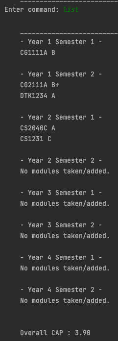
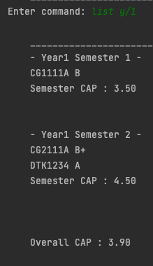
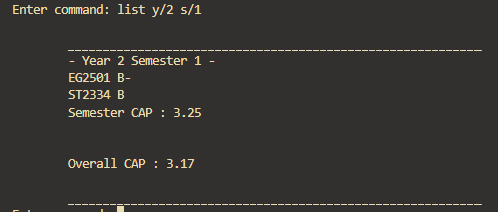
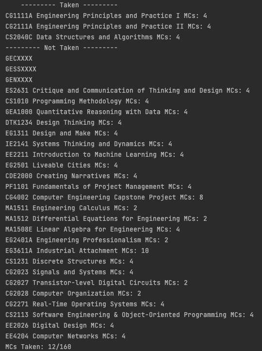
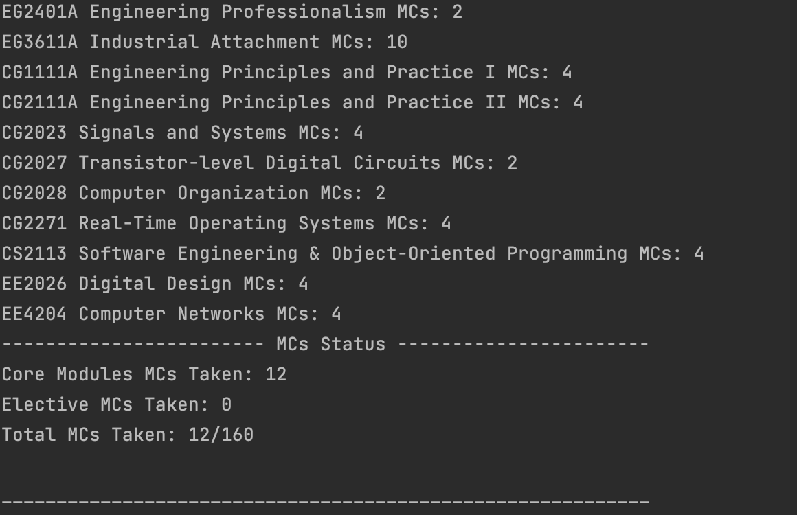
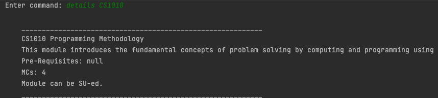
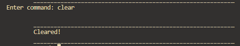
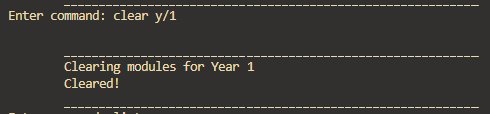
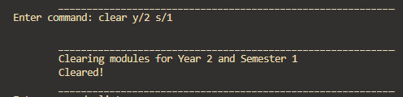
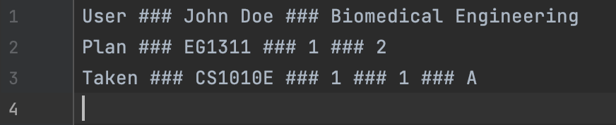

# 📜 PENUS User Guide

<pre>
 ___  _____        ______    ___  ___     ___   _________
/   \/      \     /      \  /   \/   \   /   \ /         \ 
|      __    \    |       \/    ||   |  |     ||    _     |
|     |__|    |   |        |    ||   |  |     ||     \    |
\            /    |    |   |    ||   |  |     |\      \_ /
/        ___/___  |    |   |    ||   |  |     | \_      \
|       | /     \ |    |   |    ||   |  |     |/  \      \
|_______|/   <> _\|    |   |    ||   \__/     ||   \_     |
\       /|   \____|    /\       |\            /|          |
 \__|__/  \______/\___/  \_____/  \__________/  \_________/
</pre>

## Introduction

**Planning Engineering with NUS (PENUS)** is a desktop app for managing and planning your modules in your university life!
Users are able to add modules that they have taken, plan for future modules and access useful features such as checking their graduation criteria and calculating their CAP. By using NUSmods API, users can retrieve important module details with a stroke of the keyboard.
It is optimised for use via a Command Line Interface (CLI).
For students that can type fast, PENUS can help them plan and track their modules for all four years of their time in university more efficiently.

## Table of Contents 📔
- [Quick Start](#quick-start-⚙️)
- [NUSMods API](#NUSMods-API)
- [Features](#features-👾)
    + [Initialisation: `init`](#initialisation-init)
    + [Help: `help`](#help-help)
    + [Add taken modules: `taken`](#add-taken-modules-taken)
    + [Plan untaken modules: `plan`](#plan-untaken-modules-plan)
    + [Remove a module: `remove`](#remove-a-module-remove)
    + [Mark module as taken: `mark`](#mark-module-as-taken-mark)
    + [View modules: `list`](#view-modules-list)
    + [View graduation status: `status`](#view-graduation-status-status)
    + [View module details: `details`](#view-module-details-details)
    + [Clear modules: `clear`](#clear-modules-clear)
    + [Exit: `exit`](#exit-the-program-exit)
    + [Saving the data](#saving-the-data)
    + [Editing the data file](#editing-the-data-file)
- [FAQ](#faq-💻)
- [Command Summary](#command-summary-🔑)

## Quick Start ⚙️

1. Ensure that you have Java 11 or above installed.
2. Download the latest version of PENUS from [here](https://github.com/AY2223S2-CS2113-T11-2/tp/releases/download/v2.0/penus.jar).
3. Copy the file to the folder you want to use as the home folder for your PENUS.
4. Open a command terminal, cd into the folder you put the jar file in, and use the `java -jar penus.jar` command to run the application.
5. Type the command in the Command Line Interface and press Enter to execute it.
_Some example commands you can try:_
    - `init n/John c/4`: sets user name as John and course as Computer Engineering
    - `taken CS2113 y/2 s/2 g/A+`: Adds CS2113 to Year 2 Semester 2 with grade A+.
    - `plan CS2040C y/1 s/2`: Adds CS2040C to Year 1 Semester 2 as untaken
    - `list`: list all modules in the planner with overall CAP
    - `remove CS2113`: Deletes the module CS2113
    - `clear`: Deletes all modules in the planner
    - `status`: gets the status of core modules and MCs taken.
    - `exit`: exits the application.
6. Refer to features below for details of each command

## NUSMods API
Several of our features access the NUSMods API to retrieve data for the modules. 
These features include `taken`, `plan`, `list`, `status` and `details`.
 
 

Here are some points to note:
- Please ensure you have a **stable internet connection** when using PENUS.
- Retrieving data from the NUSMods API may take a while, please expect some loading time when using the features listed above.

## Features 👾

### Initialisation: `init`
On startup, there will be a prompt for first time users to type `init` to start the initialisation process. 

 

Format:`init n/[NAME] c/[COURSE NUMBER]` 

 

| Course Number | Course                              |
|---------------|-------------------------------------|
| 1             | Biomedical Engineering              |
| 2             | Chemical Engineering                |
| 3             | Civil Engineering                   |
| 4             | Computer Engineering                |
| 5             | Electrical Engineering              |
| 6             | Environmental Engineering           |
| 7             | Industrial and Systems Engineering  |
| 8             | Mechanical Engineering              |

Example:
- `init n/John Doe c/1` Initiates a user with the name `John` and course `Biomedical Engineering`.

Note:
- Each program is limited to 1 user, ie. Initialisation more than once will overwrite the current user `name` and `course` and not create a 
separate profile

 

### Help: `help`
Shows a message with the format and functionality of all features. 

 

Format:`help`

 

### Add taken modules: `taken`
Adds a module to the planner as a taken module.

 

Format:`taken [MODULE CODE] y/[YEAR] s/[SEMESTER] g/[GRADE]`

 

Example:
- `taken CG1111A y/1 s/1 g/A+` means that you have `taken` and completed the `CG1111A` module in `Year 1` `Semester 1` with `A+` grade

 

### Plan untaken modules: `plan`
Adds a module to the planner as a module that has not been taken or completed.

 

Format:`plan [MODULE CODE] y/[YEAR] s/[SEMESTER]`

 

Example:
- `plan CG2111A y/1 s/2` means that you `plan` on taking `CG2111A` in `Year 1` `Semester 2`.

 

### Remove a module: `remove`

Removes a module from the planner.

 

Format:`remove [MODULE CODE]`

 

Example:
- `remove CS2113`

 

### Mark module as taken: `mark`
Marks the module that has been taken and update its grade. 
  Module must already have been added to the planner using the `plan` command.

 

Format:`mark [MODULE CODE] g/[GRADE]`

 

Example:
- `mark CG2111A g/A+`

 

### View modules: `list`
Displays a list of all modules taken or planned in a specified Year and/or Semester.
- If Year/Semester is not specified, then all modules will be listed.
- Filter is optional
- The difference between a `plan` and `taken` module is indicated by the presence of a grade. (only `taken` module has a grade)

 

Format:`list [FILTER]`

 

| Filter                | Action                                 | Example         |
|-----------------------|----------------------------------------|-----------------|
| [empty]               | Lists all modules in the planner       | `list`          |
| y/[YEAR]              | Lists modules in the specific year     | `list y/1`      |
| y/[YEAR] s/[SEMESTER] | Lists modules in the specific semester | `list y/1 s/1`  |

Example: 
- `list` Display all modules taken.

- `list y/2` Displays modules taken in Year 2.

- `list y/2 s/2` Displays modules taken in Year 2 Semester 2.

 

### View graduation status: `status`
Displays the status of core modules* and MCs taken. 

**Core modules are based on AY22/23*

 

Format:`status`

 

Example: `status` *(course: Computer Engineering)*

Note:
- The status command may take a while to load. Please ensure a stable internet connection.

 

### View module details: `details`
Display the module title, description, pre-requisites, MCs and SU option. 
 
Please ensure you have a stable internet connection when using this command.

 

Format: `details [MODULECODE]`

 

Example:
- `details CS1010`

 

### Clear modules: `clear`
Clears all modules in a specified Year and/or Semester.
- If neither Year nor Semester are specified, then all modules in the planner will be cleared.
- Filter is optional.

 

Format:`clear [FILTER]`

 

| Filter                | Action                                 | Example         |
|-----------------------|----------------------------------------|-----------------|
| `[empty]`               | Clears all modules in the planner       | `clear`          |
| `y/[YEAR]`              | Clears modules in the specific year     | `clear y/1`      |
| `y/[YEAR] s/[SEMESTER]` | Clears modules in the specific semester | `clear y/1 s/1`  |

Example: 
- `clear` Clears all modules in the planner.

 

- `clear y/1` Clears all modules planned/taken in Year 1.
 

- `clear y/2 s/1` Clears all modules planned/taken in Year 2 Semester 1.

 

### Exit the program: `exit`
Exits the program.

 

Format: `exit`

 

### Saving the data
PENUS's data are saved in the hard disk automatically after exiting the program. 
There is no need to save manually.

 

### Editing the data file
PENUS's data are saved as a .txt file in `[JAR file location]/data/penus.txt`. 
Edits must be made according to the formatting of the data.
- User MUST be at the **top of the file**
- If 2 Users are declared, only the first declared User will be initialised
- Line breaks/spacings are allowed
- Inclusive of valid formatting of parameters as mentioned in features above

 

Format:

| Line       | Description              | Format                                                                                      |
|------------|--------------------------|---------------------------------------------------------------------------------------------|
| 1          | User's Name and Course   | User ### NAME ### COURSE_NAME                                                               |
| 2 to n     | Taken or Planned Modules | Taken ### MODULECODE ### YEAR ### SEM ### GRADE   Plan ### MODULECODE ### YEAR ### SEM   |

 

Example:

 

 

## FAQ 💻

**Q**: How do I transfer my data to another computer? 

**A**: Install the app in the other computer and overwrite the empty data file it creates with the file in `/data/penus.txt` that contains the data of your previous PENUS application.

 

## Command Summary 🔑

| Command      | Format                                        |
|--------------|-----------------------------------------------|
| **init**     | `init n/NAME c/COURSE NUMBER`                 |
| **help**     | `help`                                        |
| **taken**    | `taken MODULE_CODE y/YEAR s/SEMESTER g/GRADE` |
| **plan**     | `plan MODULE_CODE y/YEAR s/SEMESTER`          |
| **remove**   | `remove MODULE_CODE`                          |
| **mark**     | `mark MODULE_CODE`                            |
| **list**     | `list (FILTER)`                                        |
| **status**   | `status`                                      |
| **details**  | `details MODULE_CODE`                         |
| **clear**  | `clear (FILTER)`                         |
| **exit**     | `exit`                                        |
