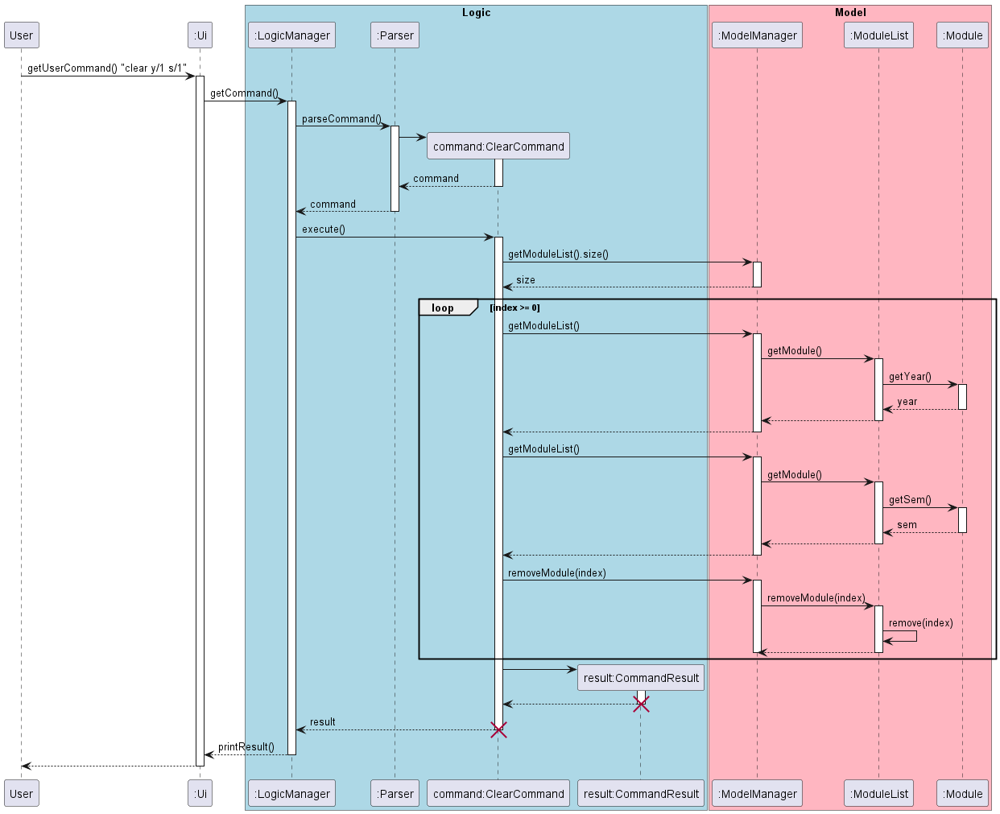

# Ansenn - Project Portfolio Page

### Project: PENUS
PENUS is a desktop app for NUS engineering students to manage and plan their modules in their university life. The user interacts with it using a CLI. It is written in Java, and has about 6 kLoC.

Given below are my contributions to the project.

- **Feature** : List command `list`
    - What it does: Displays a list of all modules taken or planned in a specified Year and/or Semester.
    - Highlights : Has a flexible format to its inputs with 3 different variations, which made it harder to parse the user's input and check for exceptions.

- **Feature** : Help Command `help`
    - What it does: Displays the list of accepted commands, and each command's purpose and use.

- **Feature**: Clear Command `clear`
    - What it does: Clears all modules added to the planner in a specified Year and/or Semester.
    - Highlights : Similar to the `list` command, the `clear` command has a flexible format to its inputs with 3 different variations, which made it harder to parse the user's input and check for exceptions.

- **Enhancement** : Changed the PENUS logo 
  - Improved the logo of PENUS

- **Code contributed**: [RepoSense link](https://nus-cs2113-ay2223s2.github.io/tp-dashboard/?search=ansenn&breakdown=true)

- **Contributions to UG**:
  - Edit formatting of various commands in the UG
  - Improved clarity of the UG in response to PE-D comments 
  - Written Documentation for:
    - List Command
    - Help Command
    - Clear Command

- **Contributions to DG**:
  - Written Documentation for:
    - List Command
    - Help Command
    - Clear Command
  - Sequence diagram for Clear Command (See extracts)

- **Contributions to team-based tasks**:
  - Assigned teammates for milestones and issues
  - Organised and assigned PE-D issues to self and teammates
  - Wrote and edited javadoc for some methods
  
- **Review/mentoring contributions:**:
  - PRs reviewed : [\#15](https://github.com/AY2223S2-CS2113-T11-2/tp/pull/15), [\#43](https://github.com/AY2223S2-CS2113-T11-2/tp/pull/43), [\#198](https://github.com/AY2223S2-CS2113-T11-2/tp/pull/198)

- **Contributions beyond the project team**:
  - Reported 11 bugs for PE-D

- **Contributions to the Developer Guide (Extracts)**:

Clear Command Sequence diagram:

