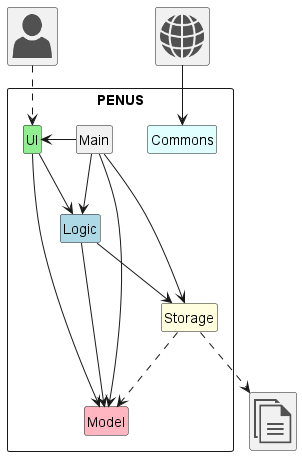
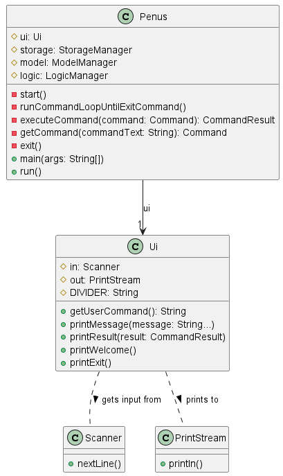
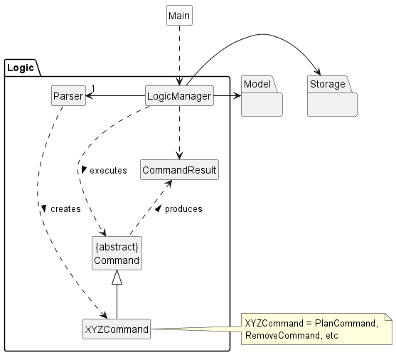
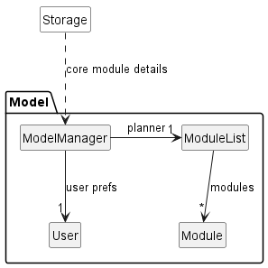
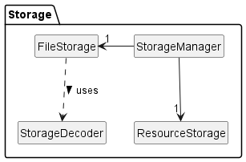
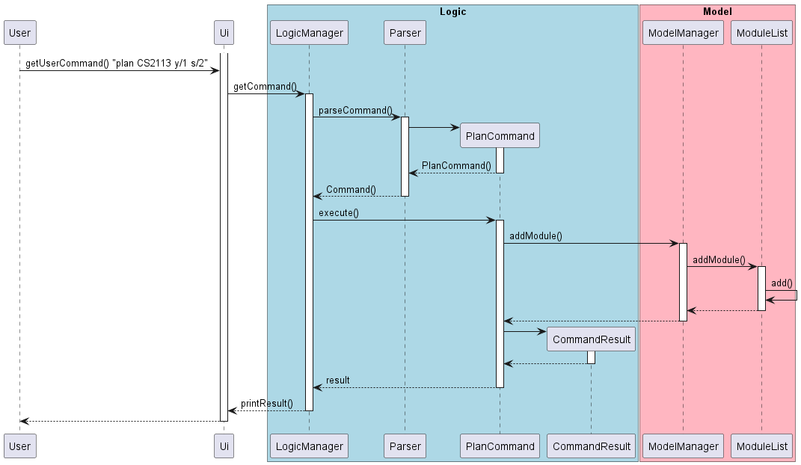
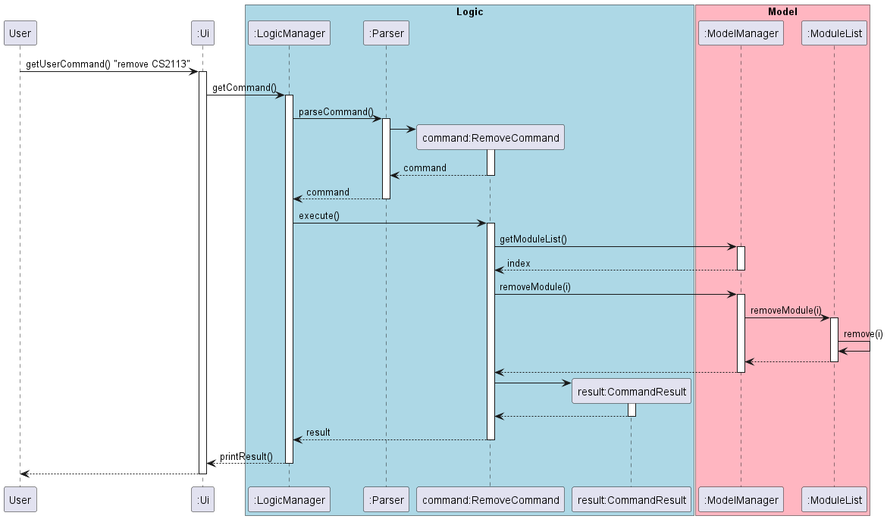
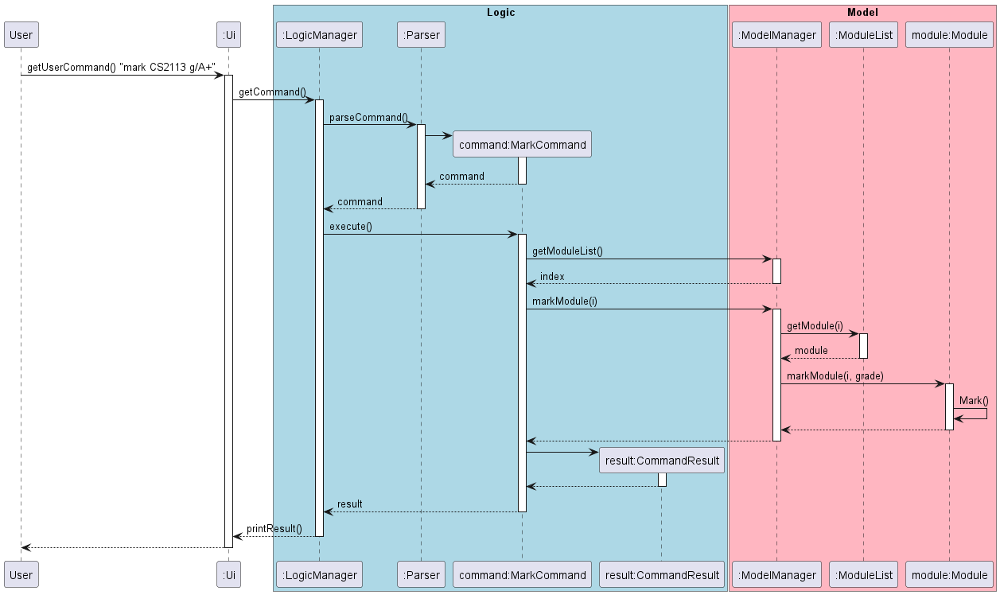
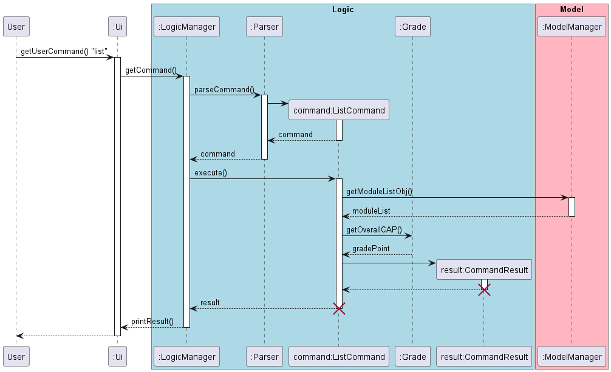
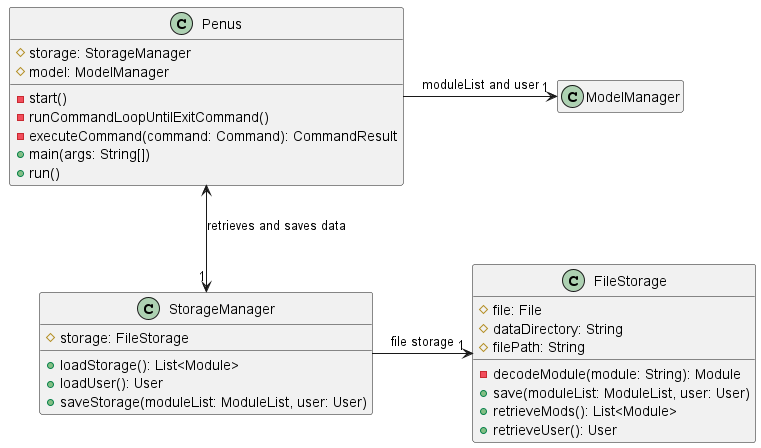

### Project: PENUS
PENUS is a desktop app for NUS engineering students to manage and plan their modules in their university life. The user interacts with it using a CLI. It is written in Java, and has about 6 kLoC.

Given below are my contributions to the project.

- **Feature**: Plan and Taken command
    - What it does: Adds a module (plan or taken) to the module list.
    - Highlights: Decided on design and chose to implement by overloading a constructor.
- **Feature**: Mark Command
- **Feature**: Remove Command
- **Feature**: Exit Command
- **Feature**: Storage saving and loading
    - What it does: enables saving data from the module list by encoding it and loads upon initialising the application
    - Highlights: Required in-depth understanding of Scanner API as 2 different types of classes needed to be read (User and Module). Challenging as all errors that the Parser class handled will need to be implemented for the loading of the .txt file.

- **Feature**: Resource retrieving from .txt file
    - Justification: Allows user to read preset core module details for the status command.
    - What it does: retrieves data from a .txt file with all core module details gathered. Saves it as a resource.
    - Highlights: Used `getResourceAsStream()` java API. Challenging as it required in-depth understanding of folder architecture and gradle. The implementation was also challenging as it required a different way to scan input. Had to manually edit vscode and intellij settings to enable resources.

- **Enhancement**: Overhaul architecture to adopt MVC design pattern
    - Justification: Improves abstraction and OOP significantly and made it easier for teammates to work on features independently as working on previous codebase asynchronously made the code messy.
    - Highlights: Affected all existing code. Required an in-depth understanding of design patterns. The implementation too was challenging as it required changes to existing commands on top of additional methods and classes.
    - Credits: [AddressBook 2](https://github.com/se-edu/addressbook-level2) and [AddressBook 3](https://github.com/se-edu/addressbook-level3).

- **Enchancement**: JUnit 100% branch coverage for PlanCommand, TakenCommand, RemoveCommand, MarkCommand

- **Code contributed**: [RepoSense link](https://nus-cs2113-ay2223s2.github.io/tp-dashboard/?search=bentohset&breakdown=true)

- **Contributions to UG**:
    - Table of contents and links
    - Quick start, FAQ, Command summary
    - Emojis to enhance look

- **Contributions to DG**:
    - Table of contents and overall structure
    - Acknowledgements, Design, Appendix A, B, C, D and E sections
    - Implementation section: Add module, Remove module, Mark module, Save planner, [Proposed] handle CS/CU
    - Diagrams: (refer to extract)

- **Contributions to team-based tasks**:
    - Set up GitHub team org and repo
    - Release management for v1.0 on GitHub
    - Set up issue tracker and milestones
    - Maintain issue tracker and milestones
    - Add javadoc to most methods

- **Review/mentoring contributions:**:
    - PRs reviewed ([\#14](https://github.com/AY2223S2-CS2113-T11-2/tp/pull/14), [\#30](https://github.com/AY2223S2-CS2113-T11-2/tp/pull/30), [\#44](https://github.com/AY2223S2-CS2113-T11-2/tp/pull/44), [\#48](https://github.com/AY2223S2-CS2113-T11-2/tp/pull/48), [\#65](https://github.com/AY2223S2-CS2113-T11-2/tp/pull/65), [\#67](https://github.com/AY2223S2-CS2113-T11-2/tp/pull/67), [\#72](https://github.com/AY2223S2-CS2113-T11-2/tp/pull/72), [\#186](https://github.com/AY2223S2-CS2113-T11-2/tp/pull/186), [\#196](https://github.com/AY2223S2-CS2113-T11-2/tp/pull/196))

- **Contributions beyond the project team**:
    - Reported 16 bugs for PE-D

- **Contributions to the Developer Guide (Extracts)**:

**Architecture diagram:**

 

Ui class diagram: | Logic object diagram: 
:-------------------------:|:-------------------------:
 | 
**Model object diagram:** | **Storage object diagram:**
  | 

**Add module sequence diagram:**

**Remove module sequence diagram:**

**Mark module sequence diagram:**

**List sequence diagram:**

**Grade class diagram:**

**Save feature class diagram:**

