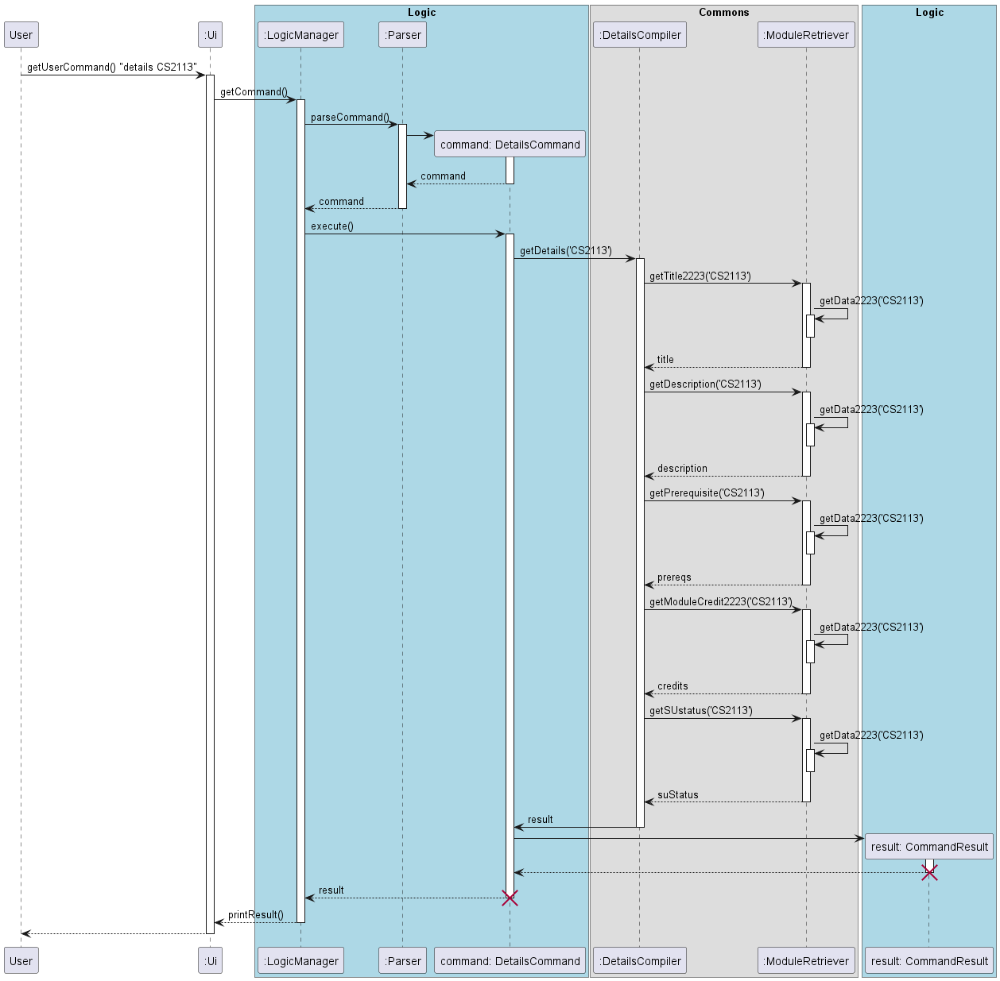

### Project: PENUS
PENUS is a desktop app for NUS engineering students to manage and plan their modules in their university life. The user interacts with it using a CLI. It is written in Java, and has about 6 kLoC.

Given below are my contributions to the project.

- **Feature**: Details command `details`
    - What it does: Retrieves details of any module that is in NUSMods, such as its title, description, 
      Pre-requisites, Number of Modular Credits and whether it can be SU-ed.
    - Highlights: Will be able to display each individual detail on its own, so even if one detail is not available, 
      it will not affect the command's functionality.

- **Feature**: Connecting to external NUSMods API
    - Justification: User will be able to retrieve details of a wide range of NUS modules. Hardcoding all the 
      modules will not be feasible, and will limit the functionality for the user.
    - What it does: Creates a "GET" request to the NUSMods API for a particular module, and retrieves all the 
      information given from the API regarding the module.
    - Highlights: Required in-depth understanding of `HttpURLConnection` in Java. Used "GET" requests to retrieve for 
      individual modules. 

- **Feature**: Working with JSON file to retrieve individual details from NUSMods API
    - Justification: NUSMods API returns a JSON file of the all the details required, which is read as String in 
      Java. It is stored as JSON again to retrieve details easily.
    - What it does: Parses retrieved String back as JSONObject, and stores in JSONArray.
    - Highlights: Had to install external dependency `com.googlecode.json-simple`. Challenging to use `JSONParser`, 
      `JSONArray`, and `JSONObject` to retrieve data from the API, as the API had nested information that were hard to 
      parse and use using the parser.

- **Tests Written**:
    - Module Retriever Tests
    - Details Compiler Tests

- **Enhancement**: Made any type of information from NUSMods API retrievable, regardless of its JSON formatting.

- **Code contributed**: [RepoSense link](https://nus-cs2113-ay2223s2.github.io/tp-dashboard/?search=sriram-senthilkr&breakdown=true)

- **Contributions to UG**:
    - Written documentation for:
      - Get Details feature

- **Contributions to DG**:
    - Implementation section: Get Module details 
    - Diagrams (refer to extract): get details sequence

- **Contributions to team-based tasks**:
    - Brainstormed for possible tP ideas
    - Assigned teammates for milestone
    - Add javadoc to most methods
    - User Stories

- **Review/mentoring contributions:**:
    - PRs reviewed [#196](https://github.com/AY2223S2-CS2113-T11-2/tp/pull/196), [#201](https://github.com/AY2223S2-CS2113-T11-2/tp/pull/201)

- **Contributions beyond the project team**:
    - Reported 11 bugs for PE-D

- **Contributions to the Developer Guide (Extracts)**:

Get Details sequence diagram:

